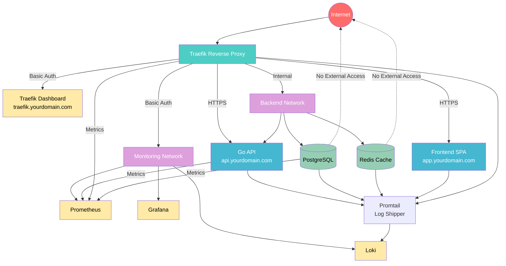

# 🚀 Nutrition Platform - Production-Grade Traefik Implementation

This directory contains a comprehensive production-ready Traefik reverse proxy setup that replaces nginx and implements all modern deployment best practices.

## 📋 Overview

This implementation provides:
- **Traefik v2.10** as the reverse proxy with advanced routing capabilities
- **Production SSL/TLS** with Let's Encrypt or Cloudflare certificate management
- **Comprehensive security** with rate limiting, security headers, and middleware chains
- **Complete monitoring stack** (Prometheus, Grafana, Loki, Promtail, Alert Manager)
- **Automated deployment** with health checks, rollback, and comprehensive testing
- **Advanced networking** with network segmentation and security best practices
- **Logging infrastructure** with structured JSON logging and log aggregation
- **Production deployment checklist** with complete verification procedures

## 📁 File Structure

```
nutrition-platform/
├── 🏗️ Core Configuration
│   ├── traefik.yml                 # Static Traefik configuration
│   ├── traefik/dynamic/dynamic.yml # Dynamic middlewares & routing configuration
│   └── docker-compose.traefik.yml  # Complete Docker Compose setup
├── 🔧 Deployment Tools
│   ├── deploy-with-traefik.sh      # Automated deployment script
│   ├── TRAEFIK_DEPLOYMENT_CHECKLIST.md # Comprehensive deployment checklist
│   └── .env.traefik.example        # Environment configuration template
├── 📊 Monitoring (existing)
│   ├── monitoring/loki-config.yaml
│   ├── monitoring/promtail-config.yml
│   ├── monitoring/prometheus.yml
│   ├── monitoring/grafana-datasources.yaml
│   ├── monitoring/dashboard.json
│   └── monitoring/alertmanager.yml
└── 🧪 Testing & Validation
    ├── TRAEFIK_CONFIGURATION_SOLUTIONS.txt # Reference documentation
    └── deploy.log                       # Deployment log (generated)
```

## 🚀 Quick Start

### 1. Environment Setup

```bash
# Copy environment template
cp .env.traefik.example .env.traefik

# Edit with your configuration
nano .env.traefik

# Source environment variables
export $(cat .env.traefik | xargs)
```

### 2. Deploy

```bash
# Make deployment script executable (if not already)
chmod +x deploy-with-traefik.sh

# Deploy the application
./deploy-with-traefik.sh deploy
```

### 3. Verify Deployment

```bash
# Check deployment status
./deploy-with-traefik.sh check

# View logs
./deploy-with-traefik.sh logs

# Check all services
docker compose -f docker-compose.traefik.yml ps
```

## 🌐 Access Points

After successful deployment, your application will be available at:

| Service | URL | Authentication |
|---------|-----|----------------|
| **Frontend** | `https://app.yourdomain.com` | Public |
| **API** | `https://api.yourdomain.com` | Public with rate limiting |
| **Traefik Dashboard** | `https://traefik.yourdomain.com` | Basic Auth |
| **Grafana** | `https://grafana.yourdomain.com` | Admin/password |
| **Prometheus** | `https://prometheus.yourdomain.com` | Basic Auth |
| **Loki** | `https://loki.yourdomain.com` | Basic Auth |

## 🔒 Security Features

### SSL/TLS
- **Let's Encrypt** automatic certificates with HTTP-01 challenge
- **Cloudflare DNS** challenge for wildcard certificates
- **TLS 1.3** with modern cipher suites
- **HSTS** headers with preload
- **Certificate monitoring** with expiration alerts

### Authentication & Authorization
- **Basic Authentication** for admin dashboards
- **JWT-based** authentication for API access
- **Rate Limiting** (50 req/min general, 25 req/min API, 5 req/min auth)
- **Security Headers** (CSP, HSTS, XSS protection, etc.)

### Network Security
- **Network Segmentation** (frontend, backend, database, monitoring)
- **Internal Networks** for sensitive services (database, cache)
- **No External Exposure** of sensitive ports (5432, 6379, etc.)
- **Container Isolation** and resource limits

## 📊 Monitoring & Observability

### Metrics Collection
- **Traefik Metrics** (HTTP requests, response times, status codes)
- **Application Metrics** (business logic, performance indicators)
- **System Metrics** (CPU, memory, disk, network)
- **Service Health Checks** (automated, with alerts)

### Logging Architecture
- **Structured JSON** logging across all services
- **Centralized Aggregation** with Loki
- **Log Shipping** via Promtail
- **Log Rotation** and retention policies
- **Error Tracking** and alerting

### Dashboards & Alerts
- **Grafana Dashboards** for visualization
- **Prometheus Alerting** rules
- **Multi-channel Notifications** (email, webhook)
- **Automatic Incident Response**

## 🏗️ Architecture



## 🛡️ Deployment Security

### Pre-Deployment Checks
- [x] Docker and Docker Compose validation
- [x] Environment variables verification
- [x] SSL certificates validation
- [x] Disk space and resource checks
- [x] Network connectivity tests

### Runtime Security
- [x] Container resource limits
- [x] Non-root user execution
- [x] Read-only file systems where possible
- [x] Secret management via environment variables
- [x] Log sanitization and filtering

### Compliance
- [x] HTTPS-only traffic
- [x] Security headers enforcement
- [x] Data encryption at rest and in transit
- [x] Audit logging and monitoring
- [x] Regular security updates

## 🔄 Maintenance & Operations

### Automated Tasks
```bash
# Daily maintenance
0 2 * * * /path/to/deploy-with-traefik.sh backup

# SSL certificate renewal (automatic via ACME)
# Log rotation (automatic via Docker)
# Health checks (continuous monitoring)
```

### Manual Operations
```bash
# Update deployment
./deploy-with-traefik.sh deploy

# Emergency rollback
./deploy-with-traefik.sh rollback

# Scale services
docker compose -f docker-compose.traefik.yml up -d --scale go-api=3

# View service status
./deploy-with-traefik.sh check
```

## 🔧 Troubleshooting

### Common Issues

#### SSL Certificate Problems
```bash
# Check certificate status
openssl s_client -connect yourdomain.com:443 -servername yourdomain.com

# Force Traefik reload
docker compose -f docker-compose.traefik.yml restart traefik
```

#### Service Unavailable
```bash
# Check service health
curl -f https://api.yourdomain.com/health

# View service logs
docker compose -f docker-compose.traefik.yml logs go-api

# Check Traefik configuration
docker compose -f docker-compose.traefik.yml exec traefik traefik version
```

#### High Resource Usage
```bash
# Monitor resource usage
docker stats $(docker ps --format "table {{.Names}}" | grep nutrition)

# Check monitoring dashboards
open https://grafana.yourdomain.com
```

### Logs and Debugging

#### Enable Debug Mode
```bash
# Set environment variable
export TRAEFIK_LOG_LEVEL=DEBUG

# Restart Traefik
docker compose -f docker-compose.traefik.yml restart traefik
```

#### Access Logs in Real-time
```bash
# Follow all logs
docker compose -f docker-compose.traefik.yml logs -f

# Follow Traefik logs only
docker compose -f docker-compose.traefik.yml logs -f traefik

# Search logs for errors
docker compose -f docker-compose.traefik.yml logs --tail=100 | grep ERROR
```

## 📈 Performance Optimization

### Current Optimizations
- [x] **Compression** (gzip) enabled
- [x] **Caching** headers configured
- [x] **Rate Limiting** prevents abuse
- [x] **Resource Limits** prevent resource exhaustion
- [x] **Health Checks** enable automatic recovery

### Additional Optimizations Available
- [ ] CDN integration
- [ ] Database connection pooling
- [ ] Application-level caching (Redis)
- [ ] Horizontal scaling
- [ ] Database read replicas

## 📚 Additional Resources

- [Traefik Documentation](https://doc.traefik.io/traefik/)
- [Let's Encrypt](https://letsencrypt.org/)
- [Docker Best Practices](https://docs.docker.com/develop/dev-best-practices/)
- [Prometheus Monitoring](https://prometheus.io/docs/)
- [Grafana Dashboards](https://grafana.com/grafana/)

## 🤝 Support

For issues with this deployment:

1. Check the [deployment checklist](TRAEFIK_DEPLOYMENT_CHECKLIST.md)
2. Review logs: `./deploy-with-traefik.sh logs`
3. Verify configuration against [environment template](.env.traefik.example)
4. Check monitoring dashboards for insights

## 📝 Version History

- **v2.0.0** - Complete Traefik production implementation
  - SSL/TLS with Let's Encrypt and Cloudflare support
  - Advanced security middlewares and rate limiting
  - Comprehensive monitoring stack
  - Automated deployment and rollback
  - Network segmentation and security hardening

---

**Ready for Production** ✅

This implementation provides a complete, production-grade deployment solution with all the tooling, monitoring, and security features needed for a modern web application.
